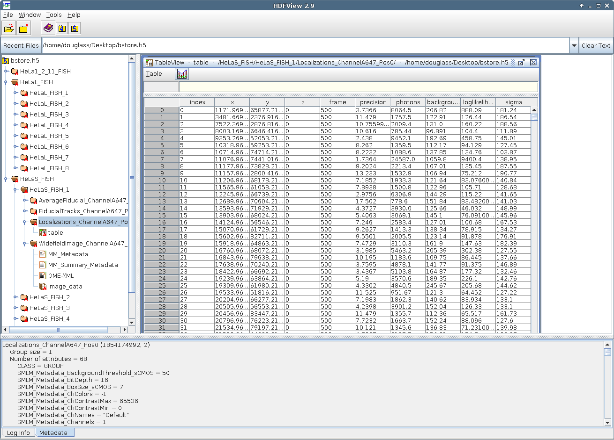

# B-Store
[](https://travis-ci.org/kmdouglass/bstore)
[](https://anaconda.org/kmdouglass/bstore)
[](https://doi.org/10.5281/zenodo.1117822)

Lightweight data management and analysis tools for single-molecule microscopy.

<!-- START doctoc generated TOC please keep comment here to allow auto update -->
<!-- DON'T EDIT THIS SECTION, INSTEAD RE-RUN doctoc TO UPDATE -->
**Table of Contents**  *generated with [DocToc](https://github.com/thlorenz/doctoc)*

- [Documentation](#documentation)
  - [Getting Help](#getting-help)
- [Citing B-Store](#citing-b-store)
- [Installation](#installation)
  - [Anaconda Package Manager](#anaconda-package-manager)
  - [Source Installs](#source-installs)
- [What is B-Store?](#what-is-b-store)

<!-- END doctoc generated TOC please keep comment here to allow auto update -->

# Documentation

The B-Store documentation is found at Read the Docs:
http://b-store.readthedocs.org.

Examples for how to use B-Store are located in the
[examples folder](https://github.com/kmdouglass/bstore/tree/master/examples).

## Getting Help

If you need help, post a question to the B-Store Google Groups
discussion page: https://groups.google.com/forum/#!forum/b-store

Bug reports may be submitted to the GitHub issue tracker:
https://github.com/kmdouglass/bstore/issues

# Citing B-Store

If you find B-Store useful, please consider citing it by referencing
the DOI of the specific version in use. For example:

> Douglass, Kyle M., Sieben, Christian, Berliner, Niklas, & Manley,
> Suliana. (2017, December 18). kmdouglass/bstore: Astigmatic 3D
> Analysis Capabilities (Version
> v1.2.0). Zenodo. http://doi.org/10.5281/zenodo.1117822

# Installation
B-Store is most easily installed from the [Anaconda Cloud package repository](https://anaconda.org/kmdouglass/bstore). If you don't already have Anaconda installed, you may download it for Python 3.5 and greater from https://www.continuum.io/downloads. Once installed, run the commands from the terminal listed below for your system. (If you're on Windows, use the Anaconda Prompt that is supplied with Anaconda.)

*Note that these commands will install B-Store into an environment named bstore that is independent of your default environment. When you want to activate this environment to use B-Store, simply type `source activate bstore` in the Linux/OSX terminal or `activate bstore` in the Windows Anaconda Prompt.*

## Anaconda Package Manager
```sh
conda update conda
conda config --append channels soft-matter
conda create -n bstore -c kmdouglass bstore
```

## Source Installs

To install from source, simply clone this repository and install
B-Store using pip.

```sh
git clone https://github.com/kmdouglass/bstore.git
pip install bstore
```

The most up-to-date code may be found on the development branch,
though it may not be as thoroughly tested as code on the
master. Source installs will always be more up-to-date than the
Anaconda packages.

A partial list of requirements to run B-Store may be found in the
[requirements.txt file](https://github.com/kmdouglass/bstore/blob/master/requirements.txt).

## Updating B-Store

If you installed B-Store using the Anaconda package manager, updating
it is easy. *The following assumes that the soft-matter and
conda-forge channels were appended to your conda config as described
above. It also assumes that you have already activated the environment
in which you installed B-Store.*

```sh
conda update -c kmdouglass bstore
```

If instead you installed B-Store from source using pip, simply
uninstall your current version, download or pull the latest code from
the GitHub repository, then install the new version as before.

## Troubleshooting

### Anaconda cannot find up-to-date version in win-64 channels

The Anaconda package manager can sometimes have difficulties when
finding the most up-to-date version of B-Store for Windows x64 (the
same problem has not been observed on Linux x64 systems). This will be
apparent when, using the directions listed above, `conda` will ask you
to verify the version of the packages to install. If during the
install `conda` indicates that it wants to install a version of
B-Store that is less than the most up-to-date version listed at the
top of this README file, then try downgrading conda. Version 4.2.x has
been known to fix this problem, whereas versions 4.3.7 and 4.3.8 have
been found to cause the problem.

In the root conda environment, enter the command:

```sh
conda install conda=4.2.16
```

# What is B-Store?

[B-Store](https://github.com/kmdouglass/bstore) is a lightweight data
management and analysis library for single molecule localization
microscopy (SMLM). It serves two primary roles:

1. To structure SMLM data inside a database for fast and easy
   information retrieval and storage.
2. To facilitate the analysis of high-throughput SMLM datasets.

As an example, you can see how SMLM data is organized by B-Store
inside a database in the HDF format below. (The software used to view
the database is not B-Store, but
[HDFView](https://www.hdfgroup.org/products/java/hdfview/) from the
HDF Group.)



Please see the [FAQ](http://b-store.readthedocs.io/en/latest/faq.html)
for more information.
