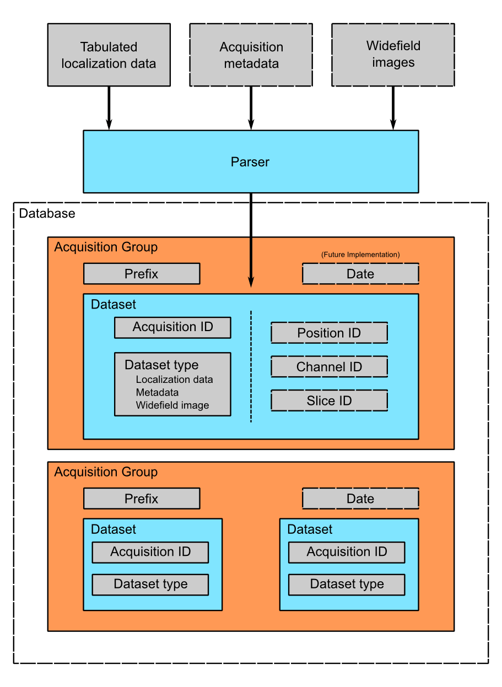

# B-Store
[](https://travis-ci.com/kmdouglass/bstore)
[](https://anaconda.org/kmdouglass/bstore)

Lightweight data management and analysis tools for single-molecule microscopy.

<!-- START doctoc generated TOC please keep comment here to allow auto update -->
<!-- DON'T EDIT THIS SECTION, INSTEAD RE-RUN doctoc TO UPDATE -->
**Table of Contents**  *generated with [DocToc](https://github.com/thlorenz/doctoc)*

- [What is B-Store?](#what-is-b-store)
  - [What problem does B-Store solve?](#what-problem-does-b-store-solve)
  - [What are the design criteria that guide B-Store's development?](#what-are-the-design-criteria-that-guide-b-stores-development)
  - [What doesn't B-Store do?](#what-doesnt-b-store-do)
- [Installation](#installation)
  - [Linux / OSX](#linux--osx)
  - [Windows](#windows)
- [How do I use B-Store?](#how-do-i-use-b-store)
- [What is the logic behind the B-Store design?](#what-is-the-logic-behind-the-b-store-design)
  - [What language is B-Store written in?](#what-language-is-b-store-written-in)
  - [I want to use B-Store, but I don't know Python.](#i-want-to-use-b-store-but-i-dont-know-python)
- [What is single molecule localization microscopy (SMLM)?](#what-is-single-molecule-localization-microscopy-smlm)
- [Acknowledgements](#acknowledgements)
  - [Authors](#authors)
  - [People and Organizations](#people-and-organizations)
  - [Software](#software)
- [What does the 'B' stand for?](#what-does-the-b-stand-for)

<!-- END doctoc generated TOC please keep comment here to allow auto update -->

# What is B-Store?

[B-Store](https://github.com/kmdouglass/bstore) is a lightweight data management and analysis library for single molecule localization microscopy (SMLM). It serves two primary roles:

1. To organize SMLM data inside a database for fast and easy information retrieval and storage.
2. To facilitate the analysis of high content SMLM datasets.

## What problem does B-Store solve?

High content SMLM experiments can produce hundreds or even thousands
of files containing multiple types of data (images, raw localizations,
acquisition information, etc.). B-Store automatically sorts and stores
this information in a database for rapid retrieval and analysis,
removing any need to manually maintain the data yourself.

## What are the design criteria that guide B-Store's development?
To realize these roles, B-Store is designed to meet these important criteria:

+ Experimental datasets must be combined into a database-like structure that is easily readable by both humans and computers.
+ Access and processing of data must be fast, regardless of the size of the dataset.
+ [Data provenance](https://en.wikipedia.org/wiki/Data_lineage) must be preserved throughout the organization and analysis pipeline.
+ B-Store should not enforce standards that force scientists to adopt file formats, naming conventions, or software packages that differ from the ones they already use, except when it is absolutely necessary to achieve its roles.
+ B-Store should be extensible to adapt to the changing needs of scientists using SMLM.
+ Above all else, B-Store should make it easy to organize and document data and analysis pipelines to improve the reproducibility of SMLM experiments.

Of course, the changing needs of scientists means that B-Store will always be evolving to meet these criteria.

## What doesn't B-Store do?
B-Store is efficient and fast because its scope is limited to SMLM data organization and analysis. In particular, B-Store does not:

+ Calculate localizations from raw images.
+ Control microscopy hardware.
+ Provide database-like storage for core facilities.
+ Generate any data or results for you. (Sorry.)

# Installation
B-Store is most easily installed from the [Anaconda Cloud package repository](https://anaconda.org/kmdouglass/bstore). If you don't already have Anaconda installed, you may download it for Python 3.5 and greater from https://www.continuum.io/downloads. Once installed, run the commands from the terminal listed below for your system. (If you're on Windows, use the Anaconda Prompt that is supplied with Anaconda.)

*Note that these commands will install B-Store into an environment named bstore that is independent of your default environment. When you want to activate this environment to use B-Store, simply type `source activate bstore` in the Linux/OSX terminal or `activate bstore` in the Windows Anaconda Prompt.*

## Linux / OSX
```sh
conda update conda
conda create --name bstore jupyter
source activate bstore
conda install -c kmdouglass -c soft-matter bstore
```

## Windows
```sh
conda update conda
conda create --name bstore jupyter
activate bstore
conda install -c kmdouglass -c soft-matter bstore
```

# How do I use B-Store?
First start a Jupyter notebook session:
```sh
jupyter notebook
```
*Remember to change to the environment where you installed B-Store
 with the command `source activate <ENV NAME>` (Linux/OSX) or
 `activate <ENV NAME>` (Windows).*

A minimal example for building a database goes like this:

```python
# Import the libraries
from bstore  import database, parsers
from pathlib import Path

# Specify the database file and create an HDF database
dbFile = 'database_test.h5'
db     = database.HDFDatabase(dbFile)

# Define the parser that reads the files.
# Also specify the directory to search for raw files.
parser          = parsers.MMParser()
searchDirectory = Path('/path/to/my/data')

# Build the database
db.build(parser, searchDirectory)
```

Since every lab uses different software and file formats for acquiring data, a customized `Parser` for interpreting your data will be required. (Don't worry. We provide help in writing your own.) For simple formats, you may even be able to use the built-in `SimpleParser`.

Once in the database, we can pull data from it in a batch process and operate on it like this:

```python
# Import the processors and batch library
from bstore import processors as proc
from bstore import batch

# Create a pipeline consisting of processors to apply to the data
filter1 = proc.Filter('uncertainty', '<', 30)
merger  = proc.Merge(mergeRadius = 30, tOff = 1, precisionColumn = 'uncertainty')
cluster = proc.Cluster(minSamples = 8, eps = 90, coordCols = ['x', 'y'])

pipeline = [filter1,
            merger,
            cluster]

# Create the batch processor and apply the pipeline to the data
bp = batch.HDFBatchProcessor(dbFile, pipeline)
bp.go()
```

The output will be a number of .csv files arranged in a subfolder containing localizations that have been processed by your pipeline. They can be opened by your favorite analysis program for rendering or further analysis. (We like [ThunderSTORM](https://github.com/zitmen/thunderstorm) and [PALMsiever](https://github.com/PALMsiever/palm-siever)).

Of course there are many more options available than in these minimal examples. You can find out more in the [examples folder](https://github.com/kmdouglass/bstore/tree/master/examples).


# What is the logic behind the B-Store design?
B-Store is designed to search specified directories on your computer for files associated with an SMLM experiment, such as those containing raw localizations and widefield images. These files are passed through a `Parser`, which converts them into a format suitable for insertion into a database. It does this by ensuring that the files satisfy the requirements of an interface known as a `DatabaseAtom`. Data that implements this interface may pass into and out of the database; data that does not implement the interface cannot. You can think of the `DatabaseAtom` interface like a guard post at a government research facility. Only people with an ID badge for that facility (the interface) may enter. In principle, B-Store does not care about the data itself or the details of the database (HDF, SQL, etc.).

At the time this README file was written, the `DatabaseAtom` interface consisted of the following properties:

1. **acquisition ID** - integer identifying a specific acquisition
2. **data** - the actual data to insert into the database, which can be numeric or otherwise
3. **prefix** - a descriptive name for the acquisition, such as the cell type or condition
4. **dataset type** - The type of data contained in the atom (currently localizations, metadata, or widefield images)
5. channel ID - the wavelength being imaged
6. date ID - the date on which an acquisition was taken
7. position ID - A single integer or integer pair identifying the position on the sample
8. slice ID - An integer identifying the axial slice acquired

The first four properties in bold are required; the last three are optional.

There are three important advantages to enforcing an interface such as this.

1. The computer will always know what kind of data it is working with and how to organize it.
2. The format of the data that you generate in your experiments can be made independent of the database, so you can do whatever you want to it. The `Parser` ensures that it is in the right format only at the point of database insertion.
3. The nature of the database and the types of data it can handle can grow and change in the future with minimal difficulty.

The logic of this interface is described graphically below. The raw data on top pass through the `Parser` and into the database, where they are organized into acquisition groups. Each group is identified by a name called a **prefix**. Within the group, a dataset possesses an **acquisition ID** and a **dataset type**. An acqusition group is a set of datasets that were acquired during an experiment. A single dataset may optionally contain multiple fields of view (**positions**), wavelengths (**channels**), or axial **slices**. The database is therefore a collection of hierarchically arranged datasets, each belonging to a different acquisition group, and each uniquely identified by the conditions of the acquisition.



## What language is B-Store written in?
B-Store is written in the [Python](https://www.python.org/) programming language (version 3) and relies heavily on a datatype known as a DataFrame. DataFrames and their functionality are provided by the [Pandas](http://pandas.pydata.org/) library and in many ways work like Excel spreadsheets but are much, much faster. Pandas is highly optimized and used extensively for both normal and big data analytics at companies and research institutions across the globe.

In addition to Pandas, B-Store implements features provided by numerous scientific, open source Python libraries like [numpy](http://www.numpy.org/) and [matplotlib](http://matplotlib.org/).

## I want to use B-Store, but I don't know Python.
If you don't know Python, you can still use B-Store in a number of ways.

The easiest way is to explore the [Jupyter notebooks](http://jupyter.org/) in the *examples* folder. Find an example that does what you want, then modify the relevant parts, such as file names. Then, simply run the notebook.

You may also wish to use B-Store's database system, but not its analysis tools. In this case, you can use the notebooks to build your database, but access and analyze the data from the programming language of your choice, such as MATLAB. B-Store currently provides functionality for a database stored in an HDF file, but the Database interface allows for an extension to SQL or something else if you find it useful.

A third option is to call the Python code from within another language. Information for doing this in MATLAB may be found at the following link, though we have not yet tested this ourselves: http://www.mathworks.com/help/matlab/call-python-libraries.html

Of course, these approaches will only take you so far. Many parts of B-Store are meant to be customized to suit each scientist's needs, and these customizations are most easily implemented in Python. Regardless, the largest amount of customization you will want to do will likely be to write a `Parser`. A `Parser` converts raw acquisition and localization data into a format that can pass through the database interface (known as a `DatabaseAtom`). If your programming language can call Python and access the `DatabaseAtom` and `Database` interfaces, then you can write the parser in the language of your choice and then pass the parsed data through these interfaces to build your database.

# What is single molecule localization microscopy (SMLM)?

SMLM is a suite of super-resolution fluorescence microscopy techniques for imaging microscopic structures (like cells and organelles) with resolutions below the diffraction limit of light. A number of SMLM techniques exist, such as [fPALM](http://www.ncbi.nlm.nih.gov/pmc/articles/PMC1635685/), [PALM](http://www.ncbi.nlm.nih.gov/pubmed/16902090), [STORM](http://www.ncbi.nlm.nih.gov/pmc/articles/PMC2700296/), and [PAINT](http://www.ncbi.nlm.nih.gov/pmc/articles/PMC1748151/). In these microscopies, fluorescent molecules are made to "blink" on and off. A final image or dataset is computed by recording the positions of every blink for a period of time and adding together all the positions in the end.

A fantastic movie explaining how this works using the blinking lights of the Eiffel tower was created by Ricardo Henriques. You can watch it here: https://www.youtube.com/watch?v=RE70GuMCzww

# Acknowledgements
## Authors
+ [Kyle Douglass](http://kmdouglass.github.io) - primary author
+ [Niklas Berliner](https://github.com/nberliner)
+ [Marcel Stefko](https://github.com/MStefko)

## People and Organizations
+ [Suliana Manley](http://leb.epfl.ch) - principal investigator
+ Christian Sieben
+ Aleksandra Vancevska
+ [SystemsX.ch](http://www.systemsx.ch/) - Funding

## Software
+ [Python](https://www.python.org/community/)
+ [Anaconda](https://www.continuum.io/why-anaconda)
+ [Pandas](http://pandas.pydata.org/)
+ [Jupyter](http://jupyter.org/)
+ [trackpy](http://soft-matter.github.io/trackpy/v0.3.0/)
+ [NumPy](http://www.numpy.org/)
+ [SciPy](https://www.scipy.org/)
+ [matplotlib](http://matplotlib.org/)
+ [h5py](http://www.h5py.org/)
+ [scikit-learn](http://scikit-learn.org/stable/)

# What does the 'B' stand for?
Blink.
