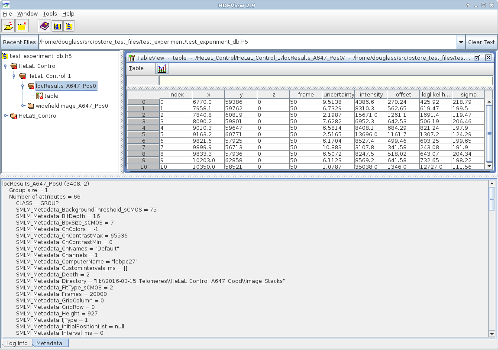

# B-Store
[](https://travis-ci.org/kmdouglass/bstore)
[](https://anaconda.org/kmdouglass/bstore)

Lightweight data management and analysis tools for single-molecule microscopy.

<!-- START doctoc generated TOC please keep comment here to allow auto update -->
<!-- DON'T EDIT THIS SECTION, INSTEAD RE-RUN doctoc TO UPDATE -->
**Table of Contents**  *generated with [DocToc](https://github.com/thlorenz/doctoc)*

- [Documentation](#documentation)
  - [Getting Help](#getting-help)
- [Installation](#installation)
  - [Anaconda Package Manager](#anaconda-package-manager)
  - [Source Installs](#source-installs)
- [What is B-Store?](#what-is-b-store)

<!-- END doctoc generated TOC please keep comment here to allow auto update -->

# Documentation

The B-Store documentation is found at Read the Docs:
http://b-store.readthedocs.org.

Examples for how to use B-Store are located in the
[examples folder](https://github.com/kmdouglass/bstore/tree/master/examples).

## Getting Help

If you need help, post a question to the B-Store Google Groups
discussion page: https://groups.google.com/forum/#!forum/b-store

Bug reports may be submitted to the GitHub issue tracker:
https://github.com/kmdouglass/bstore/issues

# Installation
B-Store is most easily installed from the [Anaconda Cloud package repository](https://anaconda.org/kmdouglass/bstore). If you don't already have Anaconda installed, you may download it for Python 3.5 and greater from https://www.continuum.io/downloads. Once installed, run the commands from the terminal listed below for your system. (If you're on Windows, use the Anaconda Prompt that is supplied with Anaconda.)

*Note that these commands will install B-Store into an environment named bstore that is independent of your default environment. When you want to activate this environment to use B-Store, simply type `source activate bstore` in the Linux/OSX terminal or `activate bstore` in the Windows Anaconda Prompt.*

## Anaconda Package Manager
```sh
conda update conda
conda config --append channels conda-forge
conda config --append channels soft-matter
conda create -n bstore -c kmdouglass bstore
```

## Source Installs

To install from source, simply clone this repository and install
B-Store using pip:

```
pip install <B-STORE DIRECTORY>
```

The most up-to-date code may be found on the development branch,
though it may not be as thoroughly tested as code on the master.

# What is B-Store?

[B-Store](https://github.com/kmdouglass/bstore) is a lightweight data
management and analysis library for single molecule localization
microscopy (SMLM). It serves two primary roles:

1. To structure SMLM data inside a database for fast and easy
   information retrieval and storage.
2. To facilitate the analysis of high-throughput SMLM datasets.

As an example, you can see how SMLM data is organized by B-Store
inside a database in the HDF format below. (The software used to view
the database is not B-Store, but
[HDFView](https://www.hdfgroup.org/products/java/hdfview/) from the
HDF Group.)



Please see the [FAQ](http://b-store.readthedocs.io/en/latest/faq.html)
for more information.
