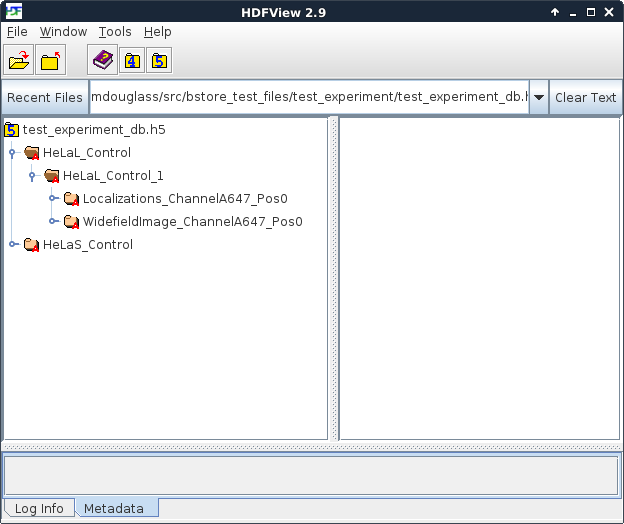

.. -*- mode: rst -*-
   
******************
B-Store Datastores
******************

:Author: Kyle M. Douglass
:Contact: kyle.m.douglass@gmail.com
:organization: École Polytechnique Fédérale de Lausanne (EPFL)
:revision: $Revision: 1 $
:date: 2016-10-15

:abstract:

   The logic behind B-Store datastores is presented in this
   document. The HDF file type is briefly explained, followed by the
   organization of data within the database.
   
.. meta::
   :keywords: b-store, database
   :description lang=en: Documentation on B-Store datastores.
	      
.. contents:: Table of Contents

Introduction to B-Store Datastores
==================================

A single high-throughput SMLM experiment can generate hundreds or even
thousands of different files containing different types of
data. Analyzing this data requires that the files are sorted and
organized in a well-structured way that is understandable by both
humans and machines. A B-Store datastore fulfills this role as a
structured container for heterogeneous SMLM data.

In basic terms, a B-Store *datastore* is a collection of individual
*datasets*. Each dataset possesses identifiers that uniquely identify
it within the datastore. A dataset also provides a container for the
actual experimental data that it is holding, such as localizations or
widefield images.

Datasets
========

A `Dataset`_ is a single, generalized dataset that can be stored in a
B-Store dataset. It is "general" in the sense that it can represent
one of a few different types of data (e.g. localizations, metadata, or
widefield images). A specific type of dataset is called a
`DatasetType`. A DatasetType knows how to read raw input files from
the disk and how to get and put data of its own type from and into a
datastore. Unlike the Datastore, which sorts and organizes Datasets,
the DatasetType encapsulates all the knowledge about data input and
output.

There are currently five dataset types (their raw input types are
listed in parantheses):

1. Localizations (tabulated localization data in raw text, csv format)
2. LocMetadata (information about how the localizations were generated
   in JSON format)
3. WidefieldImage (gray scale images; supports reading OME-XML
   metadata and Micro-Manager metadata)
4. FiducialTracks (localizations belonging to individual fiducials in
   csv format)
5. AverageFiducial (the average drift trajectory from many fiducials)

If you require a raw input type or a general DatasetType that is not
listed here, B-Store can be easily extended to support it. Please let
us know `on the forum`_.

.. _Dataset: http://b-store.readthedocs.io/en/latest/bstore.html#bstore.database.Dataset
.. _on the forum: https://groups.google.com/forum/#!forum/b-store

Dataset IDs
-----------

A dataset is uniquely defined by the following fields (the first
four--prefix, acqID, datasetType, attributeOf--are required).

prefix
    A descriptive name given to the dataset.

acqID
    An integer that specifies the acquisition number of the dataset.

datasetType 
    A string. Must be one of the types listed above. The a type must
    be in the list __Registered_DatasetTypes__ in `config.py`_ to be
    used.

attributeOf 
    A string. Must be one of the dataset types listed above. This is
    the name of a type of dataset that this one describes.

channelID
    (optional) A string that specifies the fluorescence channel that
    the dataset was acquired in.

dateID
    (optional) A string in the format YYYY-MM-DD.

posID 
    (optional) A one or two-element tuple of integers specifying the
    position of the field of view of the dataset.

sliceID
    (optional) An integer identifying the the axial slice of the
    dataset.

.. _config.py: https://github.com/kmdouglass/bstore/blob/master/bstore/config.py

Hierarchy of Dataset IDs
------------------------

All datasets with the same prefix are organized into the same
**acquisition group**. Within an acquisition group, datasets are
specified according to their acqID.

For example, let's say we take three widefield images of Cos7 cells
from the same coverslip during the same experiment. In the datastore,
each image will have the same prefix, such as 'Cos7'. The individual
images however will have three different acqID's. (Most likely they
will be 1, 2, and 3, but they need not start at 1 or be sequential.)

If two datasets have the same prefix and acqID but different
datasetType's, then they will be understood to have come from the same
field of view. This allows widefield images to be grouped with their
corresponding localizations within the database. As an example, we
might have two datasets in our datastore where both have 'HeLa' as a
prefix and 1 as the acqID, but one has 'Localizations' as its
datasetType and the other 'WidefieldImage'.

Finally, the optional identifiers can further divide datasets that
have the same prefix, acqID, and datasetTypes.

A diagram that explains this hierarchy is seen below. On top, you have
your raw data files as inputs to a parser, which both assigns dataset
IDs and converts the data into a format suitable for insertion into
the database. A single acquisition group is identified by a **prefix**
(and optionally a **dateID**). Within this group, each dataset has a
unique **acqID** and **datasetType** to set it apart from other
datasets within the same group. Finally, the other optional IDs give
you more control over how the data is organized within the group.

.. image:: ../images/dataset_logic.png
   :scale: 50%
   :align: center

The Role of Parsers in Datastores
---------------------------------

As mentioned above, a B-Store parser is an object that performs two
roles:

1. Assign dataset IDs to a dataset
2. Convert the data in the dataset into a format that may be inserted
   into a B-Store database

Since different labs often have very different ways to generate their
data, parsers were designed to be very flexible objects. The only
requirement of a parser is that it implements the functions described
by the `Parser metaclass`_; these functions specify the kinds of
outputs a Parser must provide. The types of inputs, however, are not
specified. This means that you can write a parser to convert any type
of data that you would like into a dataset (as long as it fits within
one of the datasetTypes). Furthermore, exactly how dataset IDs are
assigned remains up to you. If you want your parser to label every
single dataset with a prefix of 'Bob' then you can do that, though
obviously the utility of such a feature will be in question.

This flexibility comes at a cost, however. If the built-in parsers do
not work for your data, then it will be necessary to write your
own. An example of how to do this is provided as a `Jupyter notebook
example`_.

.. _Parser metaclass: http://b-store.readthedocs.io/en/latest/bstore.html#bstore.parsers.Parser
.. _Jupyter notebook example: https://github.com/kmdouglass/bstore/blob/master/examples/Tutorial%203%20-%20Writing%20custom%20parsers.ipynb

HDF Datastores
==============

The `HDFDatastore`_ class allows for the creation of a datastore
inside a `HDF`_ container. HDF is a high-performance file type used in
scientific and numerical computing. It is considered a standard file
type in scientific circles and is widely supported by many programming
environments. One advantage of HDF containers is that you are not
required to use B-Store code to access the data in a B-Store
datastore. Any software that can read or modify HDF files will do.

HDFDatastore objects support many features of Python sets, like list
comprehensions, filtering, and iteration.

.. _HDFDatastore: http://b-store.readthedocs.io/en/latest/bstore.html#bstore.database.HDFDatastore
.. _HDF: https://www.hdfgroup.org/

HDFView
-------

`HDFView`_ is a useful utility for viewing the contents of a HDF
container. It is freely available and recommended for trouble
shooting.

We will use screenshots taken from HDFView to explain how data is
sorted inside a B-Store datastore.

.. _HDFView: https://www.hdfgroup.org/products/java/hdfview/

Organization within an HDF datastore
------------------------------------

The figure below is a screenshot from HDFView of the B-Store test
database located in test_experiment/test_experiment_db.h5 in the
`B-Store test files repository`_. On left side of the window, you can
see a hierarchy of the groups stored inside this database. There are
two acqusition groups with prefixes **HeLaL_Control** and
**HeLaS_Control**. Inside the HeLaL_Control group, you can see that
there is one single acquisition (labeled with an **acqID** of 1).

.. _B-Store test files repository: https://github.com/kmdouglass/bstore_test_files/blob/master/test_experiment/test_experiment_db.h5

This group contains three different datasets: localizations
(Localizations_ChannelA647_Pos0), a widefield image
(WidefieldImage_A647_Pos0), and metadata describing how the
localizations were obtained. (The metadata is not directly visible in
this image because it's stored as attributes of the
Localizations_ChannelA647_Pos0 group.) Each dataset has two optional
identifiers: a **channelID** of A647 and a **posID** of 0. The dataset
keys--if they are specified--follow the format
**datasetType_channelID_posID_sliceID**. Because no sliceID is
specified, it is absent from the name of the group.

If the **dateID** is specified, then another layer of the hierarchy
will be found between the acquisition parent group and the individual
acquisitions within the group. This feature allows experiments from
the same sample but different days to be identified. For example, if a
dateID of '2016-06-30' is specified for the HeLaL_Control group, then
the key to the localizations becomes::

  HeLaL_Control/d2016_06_30/HeLaL_Control_1/Localizations_ChannelA647_Pos0

The 'd' signifies a date and underscores are used in the HDF group
name to satisfy the natural naming conventions of `PyTables`_. In
general, you won't have to worry about this somewhat strange
formatting and simply always specify your dateIDs as 'YYYY-MM-DD' when
creating your datasets. The HDFDatabase class will take care of the
format conversions for you.

.. _PyTables: http://www.pytables.org/

As seen in the next figure, the actual localization data is stored as
a table inside the Localizations_ChannelA647_Pos0 group. Metadata is
attached as `HDF attributes`_ of the group; their values are in
`JSON`_ format. All SMLM metadata starts with the string defined in
the variable __HDF_Metadata_Prefix__ in `config.py`_; this variable is
currently set to 'SMLM_Metadata_'.

.. image:: ../images/database_example_2.png
   :align: center

.. _HDF attributes: https://www.hdfgroup.org/HDF5/doc1.6/UG/13_Attributes.html
.. _JSON: http://www.json.org/
.. _config.py: https://github.com/kmdouglass/bstore/blob/master/bstore/config.py

This mode of organization was chosen for a few reasons:

1. The data is organized in a way that is easily read by both humans
   and machines. This means we can understand the organization of the
   data without any knowledge of how the datastore was created.
2. B-Store dataset IDs can be inferred from the HDF key that points to
   the data. Machines can parse the HDF key to extract the dataset
   IDs, which is done, for example, when the function
   `HDFDatastore.query()`_ is executed.
3. We take advantage of features provided by the HDF format, such as
   attributes and groups.

.. _HDFDatastore.query(): http://b-store.readthedocs.io/en/latest/bstore.html#bstore.database.HDFDatastore.query
