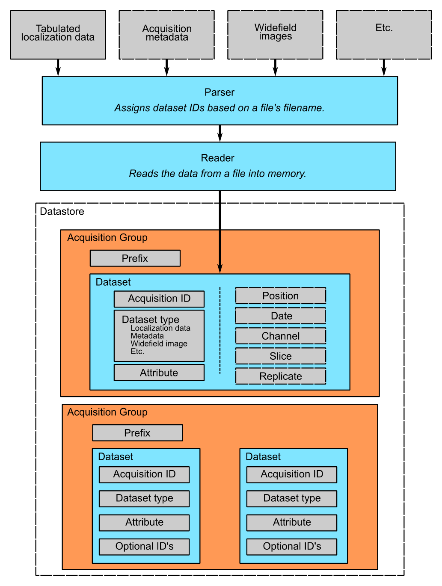

.. -*- mode: rst -*-
   
**************************
Frequently Asked Questions
**************************

:Author: Kyle M. Douglass
:Contact: kyle.m.douglass@gmail.com
:organization: École Polytechnique Fédérale de Lausanne (EPFL)
:revision: $Revision: 0 $
:date: 2016-07-10

:abstract:

   This document answers frequently asked questions regarding B-Store,
   a lightweight data management system for single molecule
   localization microscopy (SMLM).
   
.. meta::
   :keywords: faq
   :description lang=en: Frequently asked questions about B-Store, a
      lightweight data management system for single molecule
      localization microscopy.
	      
.. contents:: Table of Contents

What is B-Store?
================

B-Store is a lightweight data management and analysis library for
single molecule localization microscopy (SMLM). It serves two primary
roles:

    1. To organize SMLM data inside a database for fast and easy
       information retrieval and storage.
    2. To facilitate the analysis of high content SMLM datasets.

What problem does B-Store solve?
--------------------------------

High content SMLM experiments can produce hundreds or even thousands
of files containing multiple types of data (images, raw localizations,
acquisition information, etc.). B-Store automatically sorts and stores
this information in a database for rapid retrieval and analysis,
removing any need to manually maintain the data yourself.

What are the design criteria for B-Store?
-----------------------------------------

To realize these roles, B-Store is designed to meet these important
criteria:

    + Experimental datasets must be combined into a database-like
      structure that is easily readable by both humans and computers.
    + Access and processing of data must be fast, regardless of the
      size of the dataset.
    + Data provenance must be preserved throughout the organization
      and analysis pipeline.
    + B-Store should not enforce standards that force scientists to
      adopt file formats, naming conventions, or software packages
      that differ from the ones they already use, except when it is
      absolutely necessary to achieve its roles.
    + B-Store should be extensible to adapt to the changing needs of
      scientists using SMLM.
    + Above all else, B-Store should make it easy to organize and
      document data and analysis pipelines to improve the
      reproducibility of SMLM experiments.

Of course, the changing needs of scientists means that B-Store will
always be evolving to meet these criteria.

What doesn't B-Store do?
------------------------

B-Store is efficient and fast because its scope is limited to SMLM
data organization and analysis. In particular, B-Store does not:

    + Calculate localizations from raw images.
    + Control microscopy hardware.
    + Provide database-like storage for core facilities.
    + Generate any data or results for you. (Sorry.)

How do I use B-Store?
=====================

B-Store is currently comprised of a set of functions, classes, and
interfaces that are written in Python. You therefore can use B-Store
in any environment that runs Python code, including:

+ `Jupyter Notebooks <http://jupyter.org/>`_
+ `IPython <https://ipython.org/>`_
+ .py scripts
    
Is there a GUI interface?
-------------------------

Currently there is no GUI interface for B-Store. We may add one in the
future to facilitate normal processing routines.

Can I still use B-Store if I don't know Python?
-----------------------------------------------

If you don't know Python, you can still use B-Store in a number of
ways.

The easiest way is to explore the Jupyter notebooks in the `examples
folder
<https://github.com/kmdouglass/bstore/tree/master/examples>`_. Find an
example that does what you want, then modify the relevant parts, such
as file names. Then, simply run the notebook.

You may also wish to use B-Store's database system, but not its
analysis tools. In this case, you can use the notebooks to build your
database, but access and analyze the data from the programming
language of your choice, such as MATLAB. B-Store currently provides
functionality for a database stored in an HDF file, but the Database
interface allows for an extension to SQL or something else if you find
it useful.

A third option is to call the Python code from within another
language. Information for doing this in MATLAB may be found at the
following link, though we have not yet tested this ourselves:
http://www.mathworks.com/help/matlab/call-python-libraries.html

Of course, these approaches will only take you so far. Many parts of
B-Store are meant to be customized to suit each scientist's needs, and
these customizations are most easily implemented in
Python. Regardless, the largest amount of customization you will want
to do will likely be to write a Parser. A Parser converts raw
acquisition and localization data into a format that can pass through
the database interface (known as a DatabaseAtom). If your programming
language can call Python and access the DatabaseAtom and Database
interfaces, then you can write the parser in the language of your
choice and then pass the parsed data through these interfaces to build
your database.

How do I contribute to B-Store?
===============================

B-Store was designed to be extensible. If you have an idea, code, or
even a comment about how to improve it, we would love to hear about
it!

Send an e-mail to kyle.m.douglass@gmail.com describing what you would
like to do and we will reply within a few days.

What language is B-Store written in?
------------------------------------

B-Store is written in the Python programming language (version 3) and
relies heavily on a datatype known as a DataFrame. DataFrames and
their functionality are provided by the Pandas library and in many
ways work like Excel spreadsheets but are much, much faster. Pandas is
highly optimized and used extensively for both normal and big data
analytics at companies and research institutions across the globe.

In addition to Pandas, B-Store implements features provided by
numerous scientific, open source Python libraries like numpy and
matplotlib. If you can't do something in B-Store, you can likely still
use these libraries to achieve what you want.

What is the logic of the B-Store database?
------------------------------------------

B-Store is designed to search specified directories on your computer
for files associated with an SMLM experiment, such as those containing
raw localizations and widefield images. These files are passed through
a Parser, which converts them into a format suitable for insertion
into a database. It does this by ensuring that the files satisfy the
requirements of an interface known as a DatabaseAtom. Data that
implements this interface may pass into and out of the database; data
that does not implement the interface cannot. You can think of the
DatabaseAtom interface like a guard post at a government research
facility. Only people with an ID badge for that facility (the
interface) may enter. In principle, B-Store does not care about the
data itself or the details of the database (HDF, SQL, etc.). At the
moment, however, B-Store only supports databases contained in HDF
files.

At the time this README file was written, the DatabaseAtom interface
consisted of the following properties:

    + **acquisition ID** - integer identifying a specific acquisition
    + **data** - the actual data to insert into the database, which
      can be numeric or otherwise
    + **prefix** - a descriptive name for the acquisition, such as the
      cell type or condition
    + **dataset type** - The type of data contained in the atom
      (currently localizations, metadata, or widefield images)
    + channel ID - the wavelength being imaged
    + date ID - the date on which an acquisition was taken
    + position ID - A single integer or integer pair identifying the
      position on the sample
    + slice ID - An integer identifying the axial slice acquired

The first four properties in bold are required; the last three are
optional.

There are three important advantages to enforcing an interface such as
this.

    1. The computer will always know what kind of data it is working
       with and how to organize it.
    2. The format of the data that you generate in your experiments
       can be made independent of the database, so you can do whatever
       you want to it. The Parser ensures that it is in the right
       format only at the point of database insertion.
    3. The nature of the database and the types of data it can handle
       can grow and change in the future with minimal difficulty.

The logic of this interface is described graphically below. The raw
data on top pass through the Parser and into the database, where they
are organized into acquisition groups. Each group is identified by a
name called a prefix. Within the group, a dataset possesses an
acquisition ID and a dataset type. An acqusition group is a set of
datasets that were acquired during an experiment. A single dataset may
optionally contain multiple fields of view (positions), wavelengths
(channels), or axial slices. The database is therefore a collection of
hierarchically arranged datasets, each belonging to a different
acquisition group, and each uniquely identified by the conditions of
the acquisition.

What is the logic behind the B-Store code?
------------------------------------------

The B-Store code base is divided into five separate modules:

1. parsers
2. database
3. batch
4. processors
5. multiprocessors

The first two modules, parsers and database, contain all the code for
organizing SMLM datasets into a database. The last three modules,
batch, processors, and multiprocessors, are primarily used to for
extracting data from B-Store databases and performing (semi-)automated
analyses.

Parsers
+++++++

A parser reads files from a SMLM acquisition and produces a
DatabaseAtom--an object that can be inserted into a B-Store
database. This object will have mandatory and possibly optional fields
for uniquely identifying the data within the database.

Database
++++++++

The database module contains code for building databases from raw
data. It relies on a parser for translating files into a format that
it knows how to work with.

Batch
+++++

The batch module contains routines for performing automated analyses
with B-Store databases. It allows you to build simple analysis
pipelines for extracting just the data you need from the database.

Processors
++++++++++

Processors are objects that take just a few parameters. When called,
they accept a single argument (usually a Pandas DataFrame) as an input
and produce an object of the same datatype as an output with its data
having been modified.

Examples of processors include common SMLM analysis steps such as
Filter, Merge, and Cluster.

Multiprocessors
+++++++++++++++

Multiprocessors are similar to processors. They differ in that they
take multiple inputs to produce an output. One multiprocessor is
called OverlayClusters, which overlays clusters of localizations onto
a widefield image for visual inspection and anotation of cluster
analyses.

What is single molecule localization microscopy (SMLM)?
=======================================================

SMLM is a suite of super-resolution fluorescence microscopy techniques
for imaging microscopic structures (like cells and organelles) with
resolutions below the diffraction limit of light. A number of SMLM
techniques exist, such as fPALM, PALM, STORM, and PAINT. In these
microscopies, fluorescent molecules are made to "blink" on and off. A
final image or dataset is computed by recording the positions of every
blink for a period of time and adding together all the positions in
the end.

SMLM is a powerful tool for helping scientists understand biology and
chemistry at nanometer length scales. It is particularly well-suited
for structural biology and for tracking single fluorescent molecules
in time.

A fantastic movie explaining how this works using the blinking lights
of the Eiffel tower was created by Ricardo Henriques. You can watch it
here: `<https://www.youtube.com/watch?v=RE70GuMCzww>`_
  
What does the "B" stand for?
============================

"Blink"

