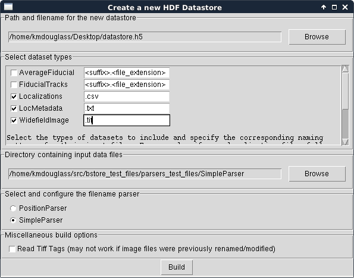

.. -*- mode: rst -*-
   
***********
Quick Start
***********

:Author: Kyle M. Douglass
:Contact: kyle.m.douglass@gmail.com
:organization: École Polytechnique Fédérale de Lausanne (EPFL)
:revision: Revision: 2
:date: 2016-10-15

:abstract:

   This quick start guide shows how to get up and running with B-Store
   as quickly as possible.
   
.. meta::
   :keywords: quickstart
   :description lang=en: Quick Start guide for B-Store.
	      
.. contents:: Table of Contents

Installation
============

Anaconda ++++++++ Installation is most easily performed using the
Anaconda package manager. `Download Anaconda for Python 3`_ (or
Miniconda) and run the following commands in the Anaconda shell::

  conda update conda
conda install -c kmdouglass -c soft-matter -c conda-forge bstore

.. _Download Anaconda for Python 3: https://www.continuum.io/downloads

Installation from Source
++++++++++++++++++++++++

Alternatively, the source code for B-Store may be cloned from
https://github.com/kmdouglass/bstore/. A list of dependencies may be
found inside the *requirements.txt* file inside the repository.

The `master branch`_ contains code that has been more thoroughly
tested than any other branch. The `development branch`_ contains the
version of the code with the latest features but is more likely to
suffer from bugs.

.. _master branch: https://github.com/kmdouglass/bstore
.. _development branch: https://github.com/kmdouglass/bstore/tree/development
      
Getting Started
===============

Background
++++++++++

The B-Store workflow is divided between these two tasks: 

1. Sort and place all the files from a single molecule localization
   microscopy (SMLM) acquisition into a single file known as a
   *Datastore*.
2. Automatically access this datastore for batch analyses.

B-Store uses popular scientific Python libraries for working with SMLM
data. Most notably, it uses `Pandas DataFrames`_ for working with
tabulated localization data and the standard `json module`_ for
handling metadata. Images are treated as `NumPy arrays`_ whose image
metadata can be read from tiff tags (OME-XML and Micro-Manager
metadata are currently supported). Reading and writing from/to HDF
files is performed with `h5py`_.

What all this means is that if you can't do something with B-Store,
chances are you can implement a custom solution using another Python
library.

.. _Pandas DataFrames: http://pandas.pydata.org/pandas-docs/stable/generated/pandas.DataFrame.html
.. _json module: https://docs.python.org/3/library/json.html
.. _NumPy arrays: http://docs.scipy.org/doc/numpy/reference/generated/numpy.array.html
.. _h5py: http://www.h5py.org/

Jupyter Notebook Examples
+++++++++++++++++++++++++

If you want to learn more after working through the quick-start guide,
then you can find examples inside the Jupyter Notebooks at the
`B-Store GitHub repository`_.

`Jupyter Notebooks`_ are a great way to interactively work with
B-Store when writing code and are very common in the scientific Python
community. They are free, powerful, and provide a convenient way to
document your work and share it with others. Alternatively, you may
use any other Python interpreter to work with B-Store functions.

.. _B-Store GitHub repository: https://github.com/kmdouglass/bstore/tree/master/examples

B-Store Test Datasets
+++++++++++++++++++++

The `B-Store test files repository`_ contains a number of datasets for
B-Store's unit tests. These datasets may also be used to try out the
code in the `examples`_ or in this guide.

.. _B-Store test files repository: https://github.com/kmdouglass/bstore_test_files
.. _examples: https://github.com/kmdouglass/bstore/tree/master/examples

Workflow Summary
++++++++++++++++

B-Store is a collection of tools for working with SMLM data. You may
interact with these tools in two different ways:

1. by using the GUI, and
2. by writing Python code

Once you have a set of HDF files, you may open them in any software
package or language that supports HDF, such as `MATLAB`_.

.. _Jupyter Notebooks: http://jupyter.org/
.. _MATLAB: https://ch.mathworks.com/products/matlab/?requestedDomain=www.mathworks.com

Build a HDF Datastore with the GUI
==================================

To start the GUI, navigate to the console window (or Anaconda
prompt). If you installed B-Store from Anaconda, be sure to activate
the bstore environment using whatever name you chose when creating
it::

  source activate bstore

If you're on Windows, don't use the word **source**.

Once activated, simply run the program by typing::

  bstore

In the window that appears, select **File > New HDF
Datastore...**. The following new dialog will appear:

.. image:: ../images/gui_screenshot_1.png
   :align: center

First, use the Browse dialog to select the name and location of the
HDF datastore file in the top-most field. Next, select what types of
datasets should be included in the datastore. For this example, check
**Localizations**, **LocMetadata**, and **WidefieldImage** and uncheck
the rest. Set the filename extension of Localizations, LocMetadata,
and WidefieldImage to **.csv**, **.txt**, and **.tif**,
respectively. This will tell the build routine what files correspond
to which types of datasets.

If your files have a special identifier in their filename, like
**locs** for localizations, you can enter search patterns like
**locs\*.csv**. The asterik (\*) will act as a wildcard such that
files like *cells_locs_2.csv* or *Cos7_alexa647_locs.csv* would be
found during the file search.

After this, choose the directory where the raw data files and
subdirectories are located. We will use the `test files for the
SimpleParser`_ for this example. Please note that this directory **and
all of its subdirectories** will be searched for files ending in the
suffix.filename_extension pattern specified in the previous field.

.. _test files for the SimpleParser: https://github.com/kmdouglass/bstore_test_files/tree/master/parsers_test_files/SimpleParser

Finally, leave the Misc. options as they are. This box allows you to
manually specify options for reading the raw data files.

'sep' for example is the separator between columns in a .csv file. If
you have a tab-separated file, change ',' to '\t' (\t is the tab
character).

Change 'readTiffTags' from False to True if you have Micro-Manager or
OME-XML metadata in your tif image files. Please note that this may
fail if the metadata does not match the filename like, for example,
what would happen if someone renamed the file.

The window should now look like this:

Click the **Build** button and when it completes, you should have a
nice, new HDF Datastore with your data files structured safely inside
it.

Programming with B-Store
========================

B-Store also has an API which allows you to write scripts and Python
code to integrate B-Store into your custom workflows.

Parsing Files to assign Dataset IDs
+++++++++++++++++++++++++++++++++++

A B-Store *Datastore* is a storage container for things like sets of
localizations, widefield images, and acquisition metadata. Each
dataset in the datastore is given a unique ID. A parser reads your
data from files and gives it a meaningful set of datastore IDs. For
example, if you have localizations stored in a comma-separated text
file named *HeLaL_Control_1.csv* and you use the built-in
`SimpleParser`_, then your dataset will have the following ID's:

1. *prefix* - 'HeLaL_Control'
2. *acqID* - 1

You can follow along by entering the following code into the Python
interpreter of your choice and using the `SimpleParser test files`_.::

   >>> import bstore.parsers as parsers
   >>> sp = parsers.SimpleParser()
   >>> sp.parseFilename('HeLaL_Control_1.csv', 'Localizations')
   >>> sp.dataset.datasetIDs
   {'acqID': 1, 'prefix': 'HeLaL_Control_1'}                                                                         

Here, `Localizations` refers to a specific dataset type used by
B-Store to read and write localization data.

B-Store comes with two built-in parsers: `SimpleParser`_ and
`PositionParser`_. The SimpleParser can read files that follow the
format **prefix_acqID.(filename extension)**. The very last item of
the filename is separated from the rest by an underscore and is always
assumed to be an integer. The first part of the filename is a
descriptive name given to the dataset.

The PositionParser is slightly more complicated, but gives you greater
flexibility over how your filenames are read. It assumes that each
dataset ID is separated by the same character(s), such as `_` or
`-`. You then specify the integer position (starting from zero!) that
each ID is found in.

For example, say you have a filename like
**HeLa_Data_3_2016-05-12.csv**. You want **HeLa** to be the prefix,
**Data** to be ignored (not used to assign an ID), **3** to be the
acquisition ID number, and **2016-05-12** to be the date. These
correspond to positions 0, 1, 2, and 3 in the filename, respectively,
and the separator is an underscore (_). You would initialize the
PositionParser like this: ::

  >>> pp = parsers.PositionParser(positionIDs = {
  >>>     0 : 'prefix', 2 : 'acqID', 3 : 'dateID'})

Changing the separator of 'positions' is also easy: simply specify a
`sep` parameter to the PositionParser's constructor. We can change the
seperator to hyphen underscore (-_) like this: ::

  >>> pp = parsers.PositionParser(
  >>>>    positionIDs = {
  >>>         0 : 'prefix', 2 : 'acqID', 3 : 'dateID'},
  >>>     sep = '-_')

If you require a customized parser to assign ID's, the Jupyter
Notebook `tutorial`_ on writing custom parsers is a good place to
look.

.. _SimpleParser test files: https://github.com/kmdouglass/bstore_test_files/tree/master/parsers_test_files/SimpleParser
.. _SimpleParser: http://b-store.readthedocs.io/en/latest/bstore.html#bstore.parsers.SimpleParser
.. _PositionParser: http://b-store.readthedocs.io/en/latest/bstore.html#bstore.parsers.PositionParser
.. _tutorial: https://github.com/kmdouglass/bstore/blob/master/examples/Tutorial%203%20-%20Writing%20custom%20parsers.ipynb

Building a Datastore
++++++++++++++++++++

You will typically not need to work directly with a parser. Instead,
the B-Store datastore will use a specified parser to automatically
read your files, assign the proper ID's, and then insert the data into
the database.

Let's say you have data from an experiment that can be parsed using
the **SimpleParser**. (Test data for this example may be found at
https://github.com/kmdouglass/bstore_test_files/tree/master/parsers_test_files/SimpleParser
.) First, we setup the parser and choose the directory containing
files and subdirectories of acquisition data.::

   >>> from bstore import database, parsers
   >>> from pathlib import Path
   >>> dataDirectory = Path('bstore_test_files/parsers_test_files/SimpleParser')
   >>> parser = parsers.SimpleParser()

Next, we create a HDFDatastore instance. This class is used to
interact with and create B-Store databases.::

   >>> dsName = 'myFirstDatastore.h5'
   >>> myDS   = database.HDFDatastore(dsName)

After this, we tell B-Store what types of files it should know how to
process: ::
  
  >>> import bstore.config as cfg
  >>> cfg.__Registered_DatasetTypes__ = [
          'Localizations', 'LocMetadata', 'WidefieldImage']

**Localizations**, **LocMetadata**, and **WidefieldImage** are
built-in dataset types. Telling B-Store what types of files to look
for helps prevent it from mistakenly thinking a random file that
accidentally entered the directory tree contains SMLM data.

Finally, we create the database by sending the parser, the parent
directory of the data files, and a dictionary telling the parser how
to find localization files to the **build** method of myDB.::

   >>> myDB.build(sp, dataDirectory, {'Localizations'  : '.csv',
                                      'LocMetadata'    : '.txt',
    	                              'WidefieldImage' : '.tif'})
   6 files were successfully parsed.
 
                            datasetType    attributeOf channelID dateID posID  sliceID
   prefix        acqID                                                         
   HeLaL_Control 1        Localizations           None      None   None  None     None
                 1       WidefieldImage           None      None   None  None     None
                 1          LocMetadata  Localizations      None   None  None     None
   HeLaS_Control 2        Localizations           None      None   None  None     None
                 2       WidefieldImage           None      None   None  None     None
                 2          LocMetadata  Localizations      None   None  None     None

This creates a file named myFirstDatabase.h5 that contains the 6
datasets listed above. (If you want to investigate the contents of the
HDF file, we recommend the `HDFView utility`_.)

.. _HDFDatabase: http://b-store.readthedocs.io/en/latest/bstore.html#bstore.database.HDFDatabase
.. _HDFView utility: https://www.hdfgroup.org/HDF5/Tutor/hdfview.html

Batch Analysis from a B-Store Database
++++++++++++++++++++++++++++++++++++++

The real utility of the B-Store database is that it enables batch
analyses of experiments containing a large number of acquisitions
containing related but different files.

As an example, let's say you want to extract all the localization
files inside the database we just created and filter out localizations
with precisions that are greater than 15 nm and loglikelihoods that
are greater than 250. We do this by first building an analysis
pipeline containing **processors** to apply in sequence to the data.::

   >>> from bstore import batch, processors
   >>> uncertaintyFilter = processors.Filter('uncertainty', '<', 15)
   >>> llhFilter = processors.Filter('loglikelihood', '<=', 250)
   >>> pipeline = [uncertaintyFilter, llhFilter]

Next, use an **HDFBatchProcessor** to access the database, pull out
all localization files, and apply the filters. The results are saved
as .csv files for later use and analysis.::

   >>> bp = batch.HDFBatchProcessor(dsName, pipeline)
   >>> bp.go()
   Output directory does not exist. Creating it...
   Created folder /home/douglass/src/processed_data

Inside each of the resulting subfolders you will see a .csv file
containing the filterd localization data. A more complete tutorial may
be found at
https://github.com/kmdouglass/bstore/blob/master/examples/Tutorial%202%20-%20Introduction%20to%20batch%20processing.ipynb .

Getting Help
============

If you have any questions, feel free to post them to the Google Groups
discussion board: https://groups.google.com/forum/#!forum/b-store

Bug reports may made on the GitHub issue tracker:
https://github.com/kmdouglass/bstore/issues
